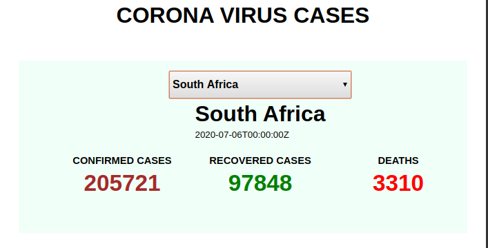

This project was bootstrapped with [Create React App](https://github.com/facebookincubator/create-react-app).


# Covid-19 International Data

This is a web application built using React, that provides summarized covid 19 data for all the countries that have been exposed to the virus.

This includes The number of confirmed cases, death cases, and recovery cases for individual countries.

I getting the data from an API https://covid19api.com/, then pulling the data and displaying it on a web page using React.


### API end-points that I have used
- API Website: https://covid19api.com/
- End-Point 1: https://api.covid19api.com/
- End-Point 2: https://api.covid19api.com/countries


## Running the application.
I'm using NPM to run the application there for to be able to run it you need to have node package manager, which you can get installation instructions here: https://www.npmjs.com/


### To contribute...
- Clone or Fork the Repo, use the terminal to follow the rest of the instructions.

- On the root folder, type `npm instal` to install all the node dependencies.

- Navigate to the root folder and type `npm start`.

- Open your browser type `http://localhost:8080/` to run the project.

- The UI and UX are pretty simple you will understand how it is written.


## Project Demo

An Image of how the interface looks...

<p></p>


## Technologies used

- ```html``` - small part of the skeleton where we render the react code

- ```css``` - I've used css grid for the layout, and css 3 for other styling

- ```js cs6``` - All functions, methods and declaration are written in **`es6`** codebase

- ```react js``` - The framewoork used to develop this is **react**

- ```ejs``` - it was used to develop the structure of the application in order to encoperate **js** in **html***
